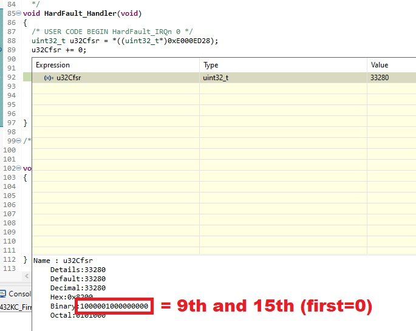
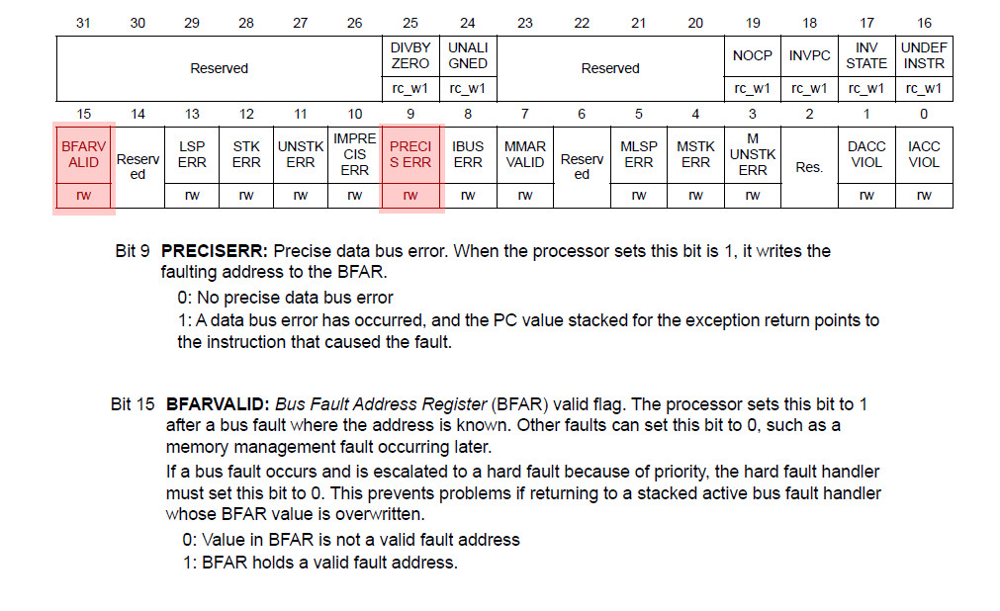
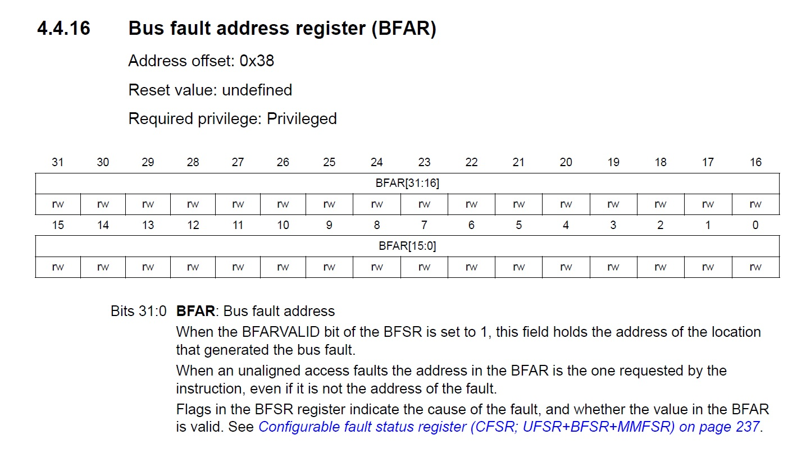
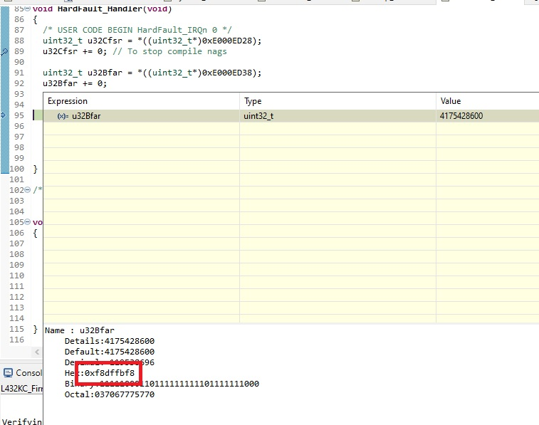

L432KC-BL-FW

# NUCLEO L432KC Bootloader and PIC Firmware Image research

This repository is for researching how to get STM32 NUCLEO-L432KC evaluation board to boot position independent firmware image code from an *arbitrary* location using custom bootloader. So to boot the same firmware blob from whatever location. (Of course the bootloader must know the address.)

Quick statuses

Bootloader: **Works. Can jump to application firmware and to even itself :D**

Firmware_anywhere: **Does not work. Temporarily running from first flash address also with -fPIC on, crashes, investigating.**

Firmware_0x8005000: ** Works when flashed to 0x8005000. Bootloader jumps to the firmware fine.**

# Research

## 2021-07-30
### 23:33
I have created a bootloader which jumps to 0x8005000. I have made a main firmware and I have configured it to run from 0x8005000. I'm now researching a way to make it relocatable.

Bootloader boots the main firmware from static location just fine.

I'm able to run the main firmware in debugger directly, passing the bootloader. This is great.

But if I now enable Position Indementend Code / -fPIC from project properties => C/C++ Build => Settings => Tool Settings => MCU GCC Compiler => Miscellaneous , the main firmware fails. Good, now I have a point to debug "bit by bit". At least now I know that -fPIC has an effect.

### 23:43
I temporarily put main firmware to 0x8000000, adjusted linker script to the address and disabled vector table offset magic in system_stm32l4xx.c . Not committed, at least not yet, just experimenting.

Now main firmware starts directly from start and of course always when pressing reset. Lets experiment with -fPIC.

Unbelievable. It ends in hardfault!

## 2021-07-31

### 01:34
Committed the PIC version. Yes, it crashes, investigating crash.

### 02:12

So it was trying to fetch 0xF8DFFBF8? There is nothing there.

### 02:38

### 18:51

### 21:31

Commit 75183df0d8a3121af1643f088deab6b19f18a505 made the crash go away when running from address 0. I basically added got* sections to linker script and added R9 stuff t startup assembly. R9 seems at least now to bo not needed.

Got some good ideas from https://github.com/rgujju/STM32-projects/tree/master/got_plt

## 2021-08-01

### 17:79

Added for reference firmware "L432KC_Firmware_0x8005000" which is "set in stone" to load itself from 0x8005000. In fSTM32CubeProgrammer, flashing bootloader to beginning of flash (0x8000000) and L432KC_Firmware_0x8005000 to 0x8005000 makes bootloader successfully jump to main.
